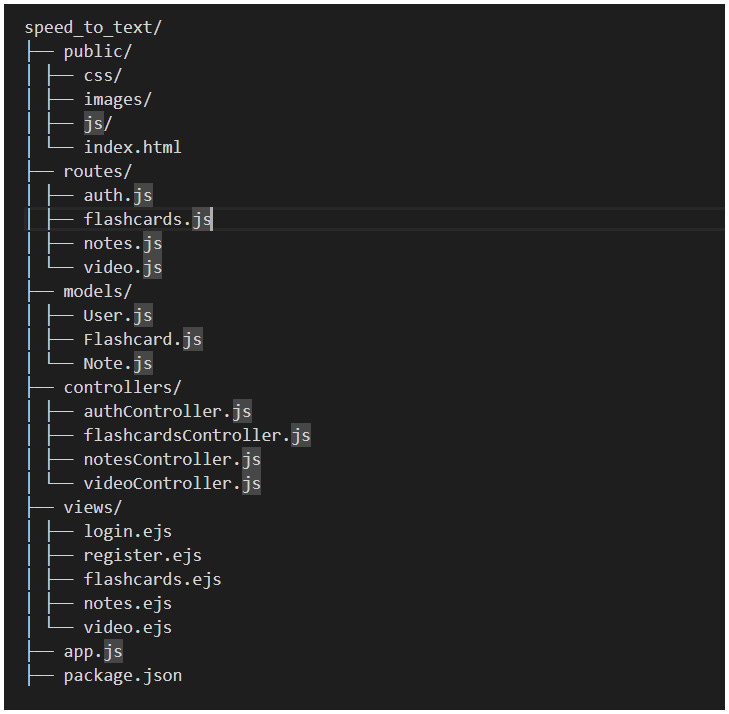

# PBL6_Speed_to_text

speed_to_text/
├── public/
│ ├── css/
│ ├── images/
│ ├── js/
│ └── index.html
├── routes/
│ ├── auth.js
│ ├── flashcards.js
│ ├── notes.js
│ └── video.js
├── models/
│ ├── User.js
│ ├── Flashcard.js
│ └── Note.js
├── controllers/
│ ├── authController.js
│ ├── flashcardsController.js
│ ├── notesController.js
│ └── videoController.js
├── views/
│ ├── login.ejs
│ ├── register.ejs
│ ├── flashcards.ejs
│ ├── notes.ejs
│ └── video.ejs
├── app.js
├── package.json

public: Chứa các file tĩnh như CSS, hình ảnh, JavaScript.

routes: Xác định các route (đường dẫn) và xử lý các yêu cầu HTTP.

models: Định nghĩa các mô hình dữ liệu tương ứng với các bảng trong cơ sở dữ liệu.

controllers: Chứa logic xử lý các yêu cầu và trả về dữ liệu cho view.

views: Chứa các template (ví dụ: EJS) để hiển thị giao diện người dùng.

app.js: File chính để khởi động ứng dụng.

package.json: Quản lý các dependency (thư viện) của dự án.

chạy lệnh: http://localhost:3000
cài đặt chạy: sequelize

- npm install ejs
